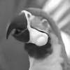
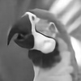
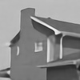
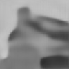
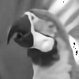
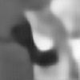
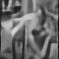
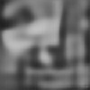

# ResCSNet
Code for ResCSNet which compresses and restores images using convolutional neural network.

The code is in pytorch. As of coding `torch.utils.tensorboard` wasn't available, so I used `tensorboardX`. (But as it turns out there is no big difference between the two)

It should run in Google Colaboratory. The notebook should be self-explanatory.

**NOTE** During my experiments I notice that certain versions of numpy or pytorch is broken. This will cause the recovered image to have ridiculous 'holes'. For example the demo image of parrot in [commit 9b8376fc402160c7b8330b15d9ee75a61822906b](https://github.com/y0umu/ResCSNet/tree/9b8376fc402160c7b8330b15d9ee75a61822906b). More recent versions of numpy (or maybe pytorch) has fixed the bug.

# Reconstruction demo
The 'ratio' in the table below refers to the compression ratio, i.e. ratio=M/N


 Original                   | ratio=0.25                                           | ratio=0.20                                           | ratio=0.15                                           
----------------------------|------------------------------------------------------|------------------------------------------------------|------------------------------------------------------
     |     |     |     
   |   |   |   
 | | | 


 Original                   | ratio=0.10                                           | ratio=0.04                                           | ratio=0.01                                           
----------------------------|------------------------------------------------------|------------------------------------------------------|------------------------------------------------------
     |     |     |     
   |   |   |   
 | | | 

# Ways to improve this work?
* Allow the input image to be of arbitary size as [this issue](https://github.com/y0umu/ResCSNet/issues/1) points out.
* Improve the loss function. Currently the DW-SSIM loss is interpreted as something multiplied by the absolute value of a cosine similarity loss. It's weired to some extent if you derive the absolute value of a cosine similarity loss. We did that to limit the range of the loss to 0-1, but is this really necessary?
* Try to remove Batchnorm layers? Although they seem to accelerate training, I read in some papers about image superesolution that Batchnorms might introduce undesired artifacts.

# Citation
```
@article{Zhang2019Image,
    author = {Zhang, Fan and Xu, Zhichao and Chen, Wei and Zhang, Zizhe and Zhong, Hao and Luan, Jiaxing and Li, Chuang},
    title = {An Image Compression Method for Video Surveillance System in Underground Mines Based on Residual Networks and Discrete Wavelet Transform},
    abstact = {Video surveillance systems play an important role in underground mines. Providing clear surveillance images is the fundamental basis for safe mining and disaster alarming. It is of significance to investigate image compression methods since the underground wireless channels only allow low transmission bandwidth. In this paper, we propose a new image compression method based on residual networks and discrete wavelet transform (DWT) to solve the image compression problem. The residual networks are used to compose the codec network. Further, we propose a novel loss function named discrete wavelet similarity (DW-SSIM) loss to train the network. Because the information of edges in the image is exposed through DWT coefficients, the proposed network can learn to preserve the edges better. Experiments show that the proposed method has an edge over the methods being compared in regards to the peak signal-to-noise ratio (PSNR) and structural similarity (SSIM), particularly at low compression ratios. Tests on noise-contaminated images also demonstrate the noise robustness of the proposed method. Our main contribution is that the proposed method is able to compress images at relatively low compression ratios while still preserving sharp edges, which suits the harsh wireless communication environment in underground mines.},
    journal = {Electronics},
    issn = {2079-9292},
    keywords = {underground mines; intelligent surveillance; residual networks; compressed sensing; image compression; image restoration; discrete wavelet transform},
    number = {12},
    volume = {8},
    article-number = {1559},
    year = {2019},
    doi = {10.3390/electronics8121559},
    url = {https://www.mdpi.com/2079-9292/8/12/1559},
}
```